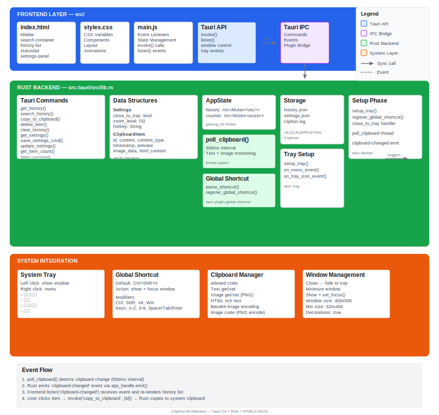

# ClipHist 架构说明

## 项目概述

ClipHist 是一个基于 Tauri 2.0 构建的剪贴板历史管理工具，支持文本、图片、链接等内容的监控、存储和快速访问。

## 技术栈

- **前端**: HTML + CSS + JavaScript (原生，无框架)
- **后端**: Rust (Tauri 2.0)
- **构建工具**: Tauri CLI
- **插件**: 
  - `tauri-plugin-global-shortcut` - 全局快捷键
  - `tauri-plugin-clipboard-manager` - 剪贴板管理
  - `tauri-plugin-opener` - 外部链接打开

## 目录结构

```
cliphist/
├── src/                          # 前端资源
│   ├── index.html               # 主页面
│   ├── main.js                  # 前端逻辑
│   ├── styles.css               # 样式表
│   └── assets/                  # 静态资源
├── src-tauri/                    # Rust 后端
│   ├── src/
│   │   ├── main.rs              # 程序入口
│   │   ├── lib.rs               # 核心逻辑
│   │   └── icon_gen.rs          # 图标生成工具
│   ├── Cargo.toml               # Rust 依赖配置
│   ├── tauri.conf.json          # Tauri 配置
│   ├── build.rs                 # 构建脚本
│   ├── capabilities/            # 权限配置
│   ├── icons/                   # 应用图标
│   └── gen/                     # 生成的 schema
└── package.json                 # Node 依赖配置
```

## 架构分层



### 前端层 (src/)

```
┌─────────────────────────────────────┐
│           index.html                │
│  - 标题栏 (titlebar)                │
│  - 搜索区域 (search-container)      │
│  - 内容区域 (content/history-list)  │
│  - 状态栏 (statusbar)              │
│  - 设置面板 (settings-panel)        │
│  - Toast 通知                       │
└─────────────────────────────────────┘
```

**组件说明**:
- `titlebar`: 窗口标题栏，包含清空、最小化、关闭按钮
- `search-container`: 分类标签页 + 搜索输入框
- `content/history-list`: 剪贴板历史列表
- `statusbar`: 状态信息显示
- `settings-panel`: 设置浮层（模态）
- `toast`: 临时通知消息

### 后端层 (src-tauri/src/lib.rs)

```
┌──────────────────────────────────────────────────────────────┐
│                        Tauri App                            │
├──────────────────────────────────────────────────────────────┤
│  Setup Phase:                                               │
│  ├── setup_tray() - 系统托盘配置                            │
│  ├── register_global_shortcut() - 全局快捷键注册             │
│  └── poll_clipboard() - 启动剪贴板监控线程                  │
├──────────────────────────────────────────────────────────────┤
│  Commands (IPC):                                            │
│  ├── get_history()      获取历史记录                        │
│  ├── search_history()   搜索历史                            │
│  ├── copy_to_clipboard() 复制到剪贴板                       │
│  ├── delete_item()      删除单条记录                        │
│  ├── clear_history()    清空历史                            │
│  ├── get_settings()     获取设置                            │
│  ├── save_settings_cmd() 保存设置                           │
│  └── update_settings()  部分更新设置                        │
├──────────────────────────────────────────────────────────────┤
│  Data Structures:                                           │
│  ├── ClipboardItem - 剪贴板条目                             │
│  ├── Settings - 应用设置                                    │
│  └── AppState - 应用状态 (history + counter)               │
└──────────────────────────────────────────────────────────────┘
```

## 核心模块

### 1. 剪贴板监控 (poll_clipboard)

位于 `lib.rs:261-303`

- 使用独立线程每 500ms 轮询剪贴板
- 支持文本和图片两种类型
- 通过 hash 检测重复内容，避免重复记录
- 文本监控时同时尝试获取 HTML 富文本

```rust
fn poll_clipboard(app_handle, state, counter)
  ├── 初始化 Clipboard
  ├── loop { 每 500ms }
  │   ├── get_text() → add_text_item()
  │   └── get_image() → add_image_item()
  └── 发送 clipboard-changed 事件到前端
```

### 2. 数据存储

| 数据 | 存储路径 | 格式 |
|------|----------|------|
| 剪贴板历史 | `%LOCALAPPDATA%/ClipHist/history.json` | JSON |
| 应用设置 | `%LOCALAPPDATA%/ClipHist/settings.json` | JSON |
| 运行日志 | `%LOCALAPPDATA%/ClipHist/cliphist.log` | 文本 |

### 3. 系统托盘

位于 `lib.rs:533-603`

- 左键点击: 显示窗口
- 菜单项:
  - 显示窗口
  - 设置
  - 清空历史
  - 退出

### 4. 全局快捷键

位于 `lib.rs:441-531`

- 默认快捷键: `Ctrl+Shift+V`
- 支持的修饰符: `Ctrl`, `Shift`, `Alt`, `Win/Meta`
- 支持的按键: A-Z, 0-9, Space, Enter, Escape, Tab
- 触发动作: 显示并聚焦主窗口

### 5. 设置管理

```rust
struct Settings {
    close_to_tray: bool,    // 关闭时最小化到托盘
    zoom_level: f32,        // 窗口缩放 (0.5-2.0)
    hotkey: String,         // 全局快捷键
}
```

## 前端交互流程

```
用户操作
    │
    ▼
main.js (事件监听)
    │
    ├── click/dblclick → copyItem() / deleteItem()
    │
    ├── search input → 过滤显示
    │
    ├── 键盘导航 → ArrowUp/Down/Enter
    │
    └── settings → openSettings() / closeSettings()
           │
           ▼
    invoke('save_settings_cmd') / invoke('update_settings')
           │
           ▼
    Rust Commands (IPC)
```

## 事件流

```
┌─────────────┐         clipboard-changed          ┌─────────────┐
│   Rust      │ ──────────────────────────────────▶ │   Frontend  │
│  (poll)     │                                    │  (main.js)  │
└─────────────┘                                    └─────────────┘
        │                                                  ▲
        │ invoke()                                          │
        │ get_history / save_settings                      │
        │ update_settings                                   │
        └──────────────────────────────────────────────────┘
```

## 依赖关系

```
Cargo.toml (Rust):
├── tauri = "2"                    # 核心框架
├── tauri-plugin-global-shortcut   # 全局快捷键
├── tauri-plugin-clipboard-manager # 剪贴板管理
├── arboard = "3"                  # 剪贴板访问
├── image = "0.25"                 # 图片处理
├── chrono = "0.4"                 # 时间处理
├── serde = "1"                    # 序列化
├── base64 = "0.22"                # Base64 编码
├── parking_lot = "0.12"           # 互斥锁
└── dirs = "5"                    # 目录路径
```

## 窗口配置

```json
{
  "title": "ClipHist",
  "width": 400,
  "height": 500,
  "minWidth": 320,
  "minHeight": 400,
  "resizable": true,
  "decorations": true,
  "transparent": false,
  "center": true
}
```

## 样式系统

使用 CSS 变量定义主题:

```css
:root {
  --bg-primary: #f3f3f3;      /* 主背景 */
  --bg-secondary: #ffffff;     /* 次级背景 */
  --text-primary: #1a1a1a;     /* 主文字 */
  --text-secondary: #5a5a5a;   /* 次级文字 */
  --accent: #0078d4;           /* 强调色 */
  --border: #e0e0e0;           /* 边框 */
  --radius: 8px;               /* 圆角 */
}
```

## 分类类型

| 类型 | 说明 | 颜色 |
|------|------|------|
| `all` | 全部 | #4F46E5 |
| `image` | 图片 | #059669 |
| `text` | 文本 | #2563EB |
| `link` | 链接 | #DC2626 |
| `short` | 短文本 | #7C3AED |
| `rich` | 富文本 | #e11d48 |

## 新增功能 (v0.5.0)

### 1. 自定义缩放
- 范围: 50% - 200%
- 步进: 10%
- 实现: CSS `zoom` 属性
- 持久化: 保存到 settings.json

### 2. 全局快捷键唤醒
- 默认: `Ctrl+Shift+V`
- 支持自定义修改
- 修改后需重启应用生效
- 使用 `tauri-plugin-global-shortcut` 实现

## 配置说明

设置文件位于: `%LOCALAPPDATA%/ClipHist/settings.json`

```json
{
  "close_to_tray": true,
  "zoom_level": 1.0,
  "hotkey": "Ctrl+Shift+V"
}
```
